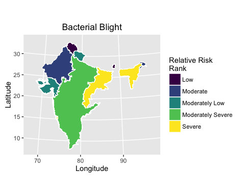
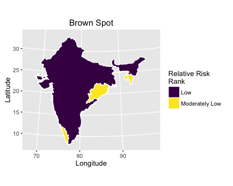

# Selected biotic stress of rice maps for India
Adam H. Sparks  
25 July 2016  


# Introduction

Diseases naturally occur as a part of any plant ecosystem. In human managed cropping systems, the environment that is created by the farmer influences disease development as well as the natural environment. Some diseases are favoured by cool, wet weather while others are more favoured by warm and wet weather. In Indian rice there are many diseases that affect rice causing yield losses. We focused on three major diseases in most tropical and sub-tropical rice growing areas are bacterial blight, caused by *Xanthomonas oryzae* pv. *oryzae*; brown spot, caused by *Cochliobolus miyabeanus*; and leaf blast, caused by *Magnaporthe oryzae*.

# Methods

To estimate the relative risk of three major rice diseases in India, the EPIRICE model [@Savary2012; @Hijmans2015] was used with spatially interpolated Global Summary of the Day (GSOD) data at 15 arc-minutes using thin-plate splines (Sparks unpublished) for the years of 2001 to 2008. The statistical software, R [@R2016] package raster [@Hijmans2016] was used to extract the resulting area under the disease progress curves by state using FAO’s Global Administrative Unit Layers (GAUL) and were classified according to relative risk. Results were compared with district level maps that had been vetted by expert Indian scientists and found to be suitable.

# Results

Bacterial leaf blight risk is most severe in the southwest and north east. The disease most commonly occurs in areas of high humidity and high temperatures. High rates of fertilization will favor disease development. Bacterial blight can be controlled using resistant varieties, proper fertilisation rates and keep the fields clean of weeds and after the season, stubble, to reduce sources of the bacteria capable of causing infection.

Brown spot risk follows a similar pattern as bacterial blight. The disease is also favoured by high temperatures but rather rice stressed by drought or low fertility rates favour disease development.  Thus rainfed rice is often afflicted with this disease. For control, use varieties that are known to be resistant, apply proper fertiliser rates and use certified or good seeds along with seed treatments as the disease is seedbourne.

Leaf blast risk is less severe than the other two diseases examined here. This disease tends to be most severe in rainfed rice areas and upland areas where there are cooler temperatures and greater day-night time temperature differences that cause dew formation on the leaf. The risk of this diease is the highest in far northeast India but risk is also elevated in the mountainous regions of the southwest and far north. Leaf blast can be devsatating, to control it, plant after the start of the rainy season, if possible and use proper fertiliser rates. Do not overfertilise with nitrogen, split applications can help reduce the risk.

# Code

## Import, process and generate spatial objects


```r
#### Load libraries #####
if (!require("maptools")) {
  library(maptools)
}
```

```
## Loading required package: maptools
```

```
## Loading required package: sp
```

```
## Checking rgeos availability: TRUE
```

```r
if (!require("raster")) {
  library(raster)
}
```

```
## Loading required package: raster
```

```r
if (!require("rgdal")) {
  library(rgdal)
}
```

```
## Loading required package: rgdal
```

```
## rgdal: version: 1.1-10, (SVN revision 622)
##  Geospatial Data Abstraction Library extensions to R successfully loaded
##  Loaded GDAL runtime: GDAL 1.11.3, released 2015/09/16
##  Path to GDAL shared files: /usr/local/Cellar/gdal/1.11.3_1/share/gdal
##  Loaded PROJ.4 runtime: Rel. 4.9.2, 08 September 2015, [PJ_VERSION: 492]
##  Path to PROJ.4 shared files: (autodetected)
##  Linking to sp version: 1.2-3
```

```r
if (!require("plyr")) {
  library(plyr)
}
```

```
## Loading required package: plyr
```

```r
if (!require("classInt")) {
  library(classInt)
}
```

```
## Loading required package: classInt
```

```r
if (!require("ggplot2")) {
  library(classInt)
}
```

```
## Loading required package: ggplot2
```

```r
if (!require("rgeos")) {
  library(rgeos)
}
```

```
## Loading required package: rgeos
```

```
## rgeos version: 0.3-19, (SVN revision 524)
##  GEOS runtime version: 3.5.0-CAPI-1.9.0 r4084 
##  Linking to sp version: 1.2-3 
##  Polygon checking: TRUE
```

```r
if (!require("viridis")) {
  library(viridis)
}
```

```
## Loading required package: viridis
```

```r
#### End load libraries ####

#### Load data ####
# GAUL Level 1 country layer (FAO)
IND <- readOGR(dsn = "/Users/asparks/Google Drive/Data/gaul/g2015_2014_1/India",
               layer = "India")
```

```
## OGR data source with driver: ESRI Shapefile 
## Source: "/Users/asparks/Google Drive/Data/gaul/g2015_2014_1/India", layer: "India"
## with 34 features
## It has 10 fields
```

```r
# EPIRICE Output
diseases <- list(stack(list.files(path = "Data/EPIRICE 25deg 01-08 PK1/",
                                  pattern = "bblight_audpc.tif$",
                                  full.names = TRUE)),
                 stack(list.files(path = "Data/EPIRICE 25deg 01-08 PK1/",
                                  pattern = "bspot_audpc.tif$",
                                  full.names = TRUE)),
                 stack(list.files(path = "Data/EPIRICE 25deg 01-08 PK1/",
                                  pattern = "_blast_audpc.tif$",
                                  full.names = TRUE)))

names(diseases) <- c("bb", "bs", "lb")

# Pre-allocate a list to store results from loop
k <- vector(mode = "list", length = 3)

for (i in 1:3) {
  # extract the values for each state
  j <- extract(mean(diseases[[i]], na.rm = TRUE), IND, coordinates(IND),
               method = "bilinear", fun = mean)
  
  # unlist and generate mean values for each polygon
  j <- data.frame(unlist(lapply(j, FUN = mean)))
  
  row.names(j) <- row.names(IND)
  names(j) <- names(diseases[i])
  row.names(IND) <- row.names(IND)
  
  k[[i]] <- spCbind(IND, j)
}

rm("i", "j", "diseases")

names(k) <- c("IND_bb", "IND_bs", "IND_lb")

IND_bb_df <- fortify(k$IND_bb, id = "bb", region = "bb")
IND_bs_df <- fortify(k$IND_bs, id = "bs", region = "bs")
IND_lb_df <- fortify(k$IND_lb, id = "lb", region = "lb")
names(IND_bb_df) <- names(IND_bs_df) <- names(IND_lb_df) <- c("Longitude",
                                                              "Latitude",
                                                              "order",
                                                              "hole",
                                                              "piece",
                                                              "group",
                                                              "id")

IND_bb_breaks <- round(classIntervals(as.numeric(IND_bb_df$id), 5,
                                      style = "equal", labels = FALSE)$brks, 0)
IND_bs_breaks <- round(classIntervals(as.numeric(IND_bs_df$id), 5,
                                      style = "equal", labels = FALSE)$brks, 0)
IND_lb_breaks <- round(classIntervals(as.numeric(IND_lb_df$id), 5,
                                      style = "equal", labels = FALSE)$brks, 0)

labs <- c("Low", "Moderately Low", "Moderate", "Moderately Severe", "Severe")

k$IND_bb@data$bb <- cut(k$IND_bb@data$bb, breaks = IND_bb_breaks,
                        include.lowest = TRUE,
                        labels = labs)
k$IND_bs@data$bs <- cut(k$IND_bs@data$bs, breaks = IND_bs_breaks,
                        include.lowest = TRUE,
                        labels = labs)
k$IND_lb@data$lb <- cut(k$IND_lb@data$lb, breaks = IND_lb_breaks,
                        include.lowest = TRUE,
                        labels = labs)
```

## Example Maps


```r
# Create a dataframe for ggplot
IND_bb_fort <- fortify(k$IND_bb, id = "bb", region = "bb")

ggplot(data = IND_bb_fort, aes(x = long, y = lat, group = group,
                               fill = id)) +
  geom_polygon(color = "white", size = 0.2) +
  labs(x = "Longitude", y = "Latitude", title = "Bacterial Blight") +
  scale_fill_viridis(name = "Relative Risk\nRank", discrete = TRUE) +
  coord_map("lambert", lat0 = 6.755997, lat1 = 33.17194)
```




```r
# Create a dataframe for ggplot
IND_bs_fort <- fortify(k$IND_bs, id = "bs", region = "bs")

ggplot(data = IND_bs_fort, aes(x = long, y = lat, group = group,
                               fill = id)) +
  geom_polygon(color = "white", size = 0.2) +
  labs(x = "Longitude", y = "Latitude", title = "Brown Spot") +
  scale_fill_viridis(name = "Relative Risk\nRank", discrete = TRUE) +
  coord_map("lambert", lat0 = 6.755997, lat1 = 33.17194)
```




```r
# Create a dataframe for ggplot
IND_lb_fort <- fortify(k$IND_lb, id = "lb", region = "lb")

ggplot(data = IND_lb_fort, aes(x = long, y = lat, group = group,
                               fill = id)) +
  geom_polygon(color = "white", size = 0.2) +
  labs(x = "Longitude", y = "Latitude", title = "Leaf Blast") +
  scale_fill_viridis(name = "Relative Risk\nRank", discrete = TRUE) +
  coord_map("lambert", lat0 = 6.755997, lat1 = 33.17194)
```


## Generate shapefiles


```r
writeOGR(k$IND_bb, dsn = "Cache", layer = "India_Bacterial_Blight_2001-2008",
         driver = "ESRI Shapefile", overwrite_layer = TRUE)
writeOGR(k$IND_bs, dsn = "Cache", layer = "India_Brown_Spot_2001-2008",
         driver = "ESRI Shapefile", overwrite_layer = TRUE)
writeOGR(k$IND_lb, dsn = "Cache", layer = "India_Leaf_Blast_2001-2008",
         driver = "ESRI Shapefile", overwrite_layer = TRUE)
```

## Generate CSV files


```r
i <- data.frame(k$IND_bb@data$ADM1_NAME, k$IND_bb@data$bb, k$IND_bs@data$bs,
                k$IND_lb@data$lb)
names(i) <- c("ADM1_NAME", "Bacterial_Blight_Risk", "Brown_Spot_Risk",
              "Leaf_Blast_Risk")
write.csv(i, file = "Cache/India_BB-BS-LB_Severity_2001-2008.csv",
          row.names = FALSE)
```

# Acknowledgements

This work was conducted as a part of the [Stress-Tolerant Varieties for Africa and South Asia (STRASA)](http://strasa.irri.org) Project, Phase III which is funded by the Bill and Melinda Gates Foundation.

# References
